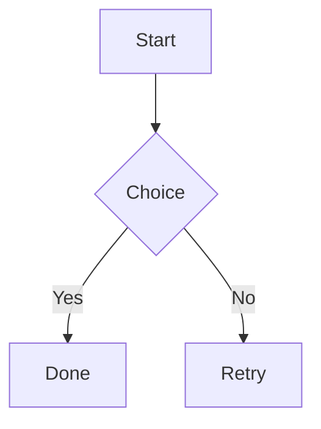

# Sample Document

## Section Two

### Section Three

Paragraph with **bold**, *italic*, `code`, a [link](https://example.com), ~~strikethrough~~, and a footnote reference[^1].

> Blockquote fallback with **bold quote** text.

> [!NOTE]
> Callout body with **bold** text and a [callout link](https://example.com/callout).

- bullet one
- bullet two
- [ ] unchecked task item
- [x] checked task item

1. first item
2. second item

---

```python
def hello() -> None:
    print("world")
```

| Name | Qty | Note |
| :--- | :---: | ---: |
| Apples | 3 | **Bold cell** with *italic* |
| Pears | `code cell` | [linked cell](https://example.com/table) |




[^1]: Footnote body text for export validation.
