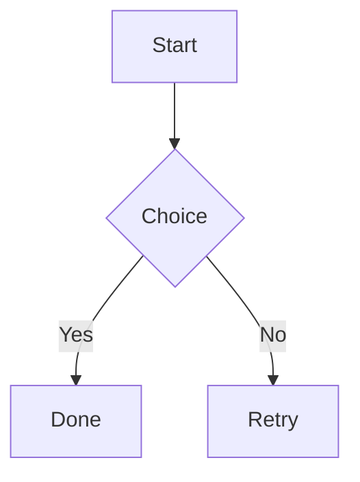

# Sample Document

## Section Two

### Section Three

Paragraph with **bold**, *italic*, `code`, and a [link](https://example.com).

- bullet one
- bullet two

1. first item
2. second item

```python
def hello() -> None:
    print("world")
```

| Name | Qty | Note |
| --- | --- | --- |
| Apples | 3 | Fresh |



